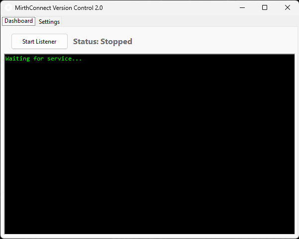
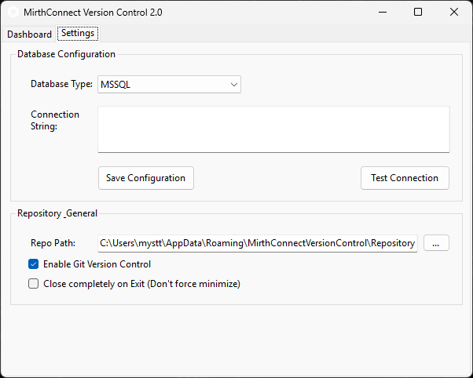

<h1>MCVC - Mirth Connect Version Control</h1>

**Allow you to backup your Mirth Connect Channels with full changes history**

<h2>About this Project</h2>

With this tool, you will be able to monitor what changes occur in the configuration of channels saved in the database. 
An independently running application, after connecting to the database, monitors the table with channels, 
and after a change occurs, saves the configuration of a given channel to the repository directory.

Supported databases:
- MSSQL
- PostgreSQL
- MySQL
- Oracle

<h2>How to use</h2>

### Installation

> **Note:** The installer is currently unsigned. Windows SmartScreen may show a warning during installation.  
> Click **"More info"** → **"Run anyway"** to proceed. We're working on obtaining a code signing certificate.

### Dashboard Tab

The Dashboard is the main control center of the application. Here you can start/stop the database listener and monitor its activity.

- **Start Listener / Stop Listener** - Click this button to start or stop monitoring the database for channel changes
- **Status** - Shows the current state of the listener (Running/Stopped)
- **Console Log** - A real-time log display showing all application activity, including database connections, channel saves, and any errors

### Settings Tab

The Settings tab contains all configuration options for the application.

#### Database Configuration

- **Database Type** - Select your Mirth Connect database type (MSSQL, PostgreSQL, MySQL, or Oracle)
- **Connection String** - Enter your database connection string (displayed as asterisks for security)
- **Test Connection** - Verify your database connection before starting the listener
- **Save Configuration** - Save your current settings

#### Repository & General

- **Repo Path** - Specifies the location where the repository of saved channel files is located. Use the "..." button to browse for a folder
- **Enable Git Version Control** - When checked, the saved files will be committed to a Git repository for each change. When unchecked, each version of the file will be saved separately with a specified date and revision number
- **Close completely on Exit** - When unchecked, clicking the close button will minimize the application to the system tray. When checked, it will close the program completely

<h2>System Tray</h2>

The application includes system tray integration. When minimized (if "Close completely on Exit" is unchecked), you can:
- Double-click the tray icon to restore the window
- Right-click for a context menu with "Open" and "Exit" options

<h2>Code Signing Policy</h2>

Free code signing provided by [SignPath.io](https://about.signpath.io), certificate by [SignPath Foundation](https://signpath.org).

**Maintainer:** [Mysttic](https://github.com/Mysttic)

**Privacy:** This program will not transfer any information to other networked systems unless specifically requested by the user (database connection configured by user).

<h2>Disclaimer</h2>
This project and its creators are not affiliated with NextGen Healthcare in any way.

The solution is an independent application not linked to the Mirth Connect product source code.

For more information on regulations, please see the licensing arrangements.
